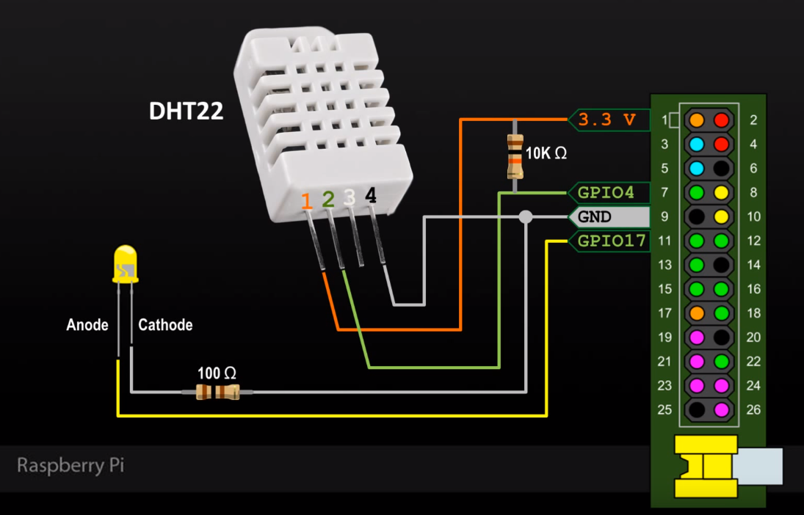

# Temperature Sensor

A small Raspberry Pi application that reads temperature and humidity from a
DHT22 sensor, stores readings in MySQL, and streams them to a browser over a
WebSocket. An LED blinks whenever the sensor is read.



The hardware setup was based on this
[YouTube tutorial](https://www.youtube.com/watch?v=IHTnU1T8ETk).

## Requirements

- Raspberry Pi with a DHT22 sensor and LED
- Node.js 18 or later (Node.js 22 is the recommended and pinned runtime)
- MySQL
- A web server or reverse proxy capable of serving `web/` and proxying
  WebSockets

## Setup

1. Connect the hardware using the pin layout above.
2. Create the database and table:

   ```sh
   mysql -u root -p -e "CREATE DATABASE IF NOT EXISTS Temperature"
   mysql -u root -p Temperature < database.sql
   ```

3. Install the server dependencies:

   ```sh
   cd server
   npm ci
   ```

4. Copy `server/config.sample.json` to `server/config.json` and configure the
   GPIO pins, polling interval, server port, and database credentials.
5. Configure the reverse proxy so `/api/` forwards WebSocket and HTTP traffic
   to the configured server port.
6. Start the sensor server:

   ```sh
   npm start
   ```

The browser derives the WebSocket host and protocol from the current page, so
no production hostname is embedded in the frontend.

## Endpoints

- `GET /health` returns server status and the in-memory reading count.
- `GET /temperature` returns the latest temperature.
- `GET /humidity` returns the latest humidity.
- `GET /feels_like` returns the latest calculated humidex.

The reading endpoints return HTTP 503 until the first reading is available.

### Database-only mode

Set `server.enabled` to `false` in `server/config.json` to disable the HTTP
and WebSocket API entirely. The app then only polls the sensor and writes
readings to the database — useful when another application consumes the data
directly. When the API is enabled (the default when `enabled` is omitted),
`server.port` must be configured.
